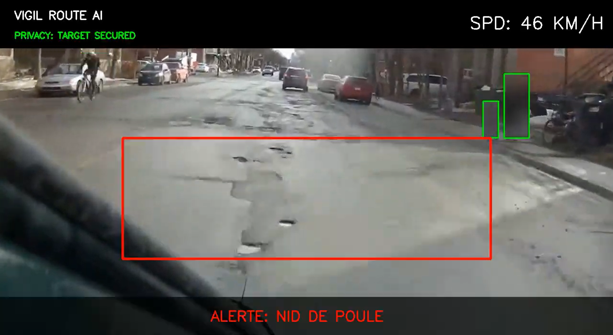
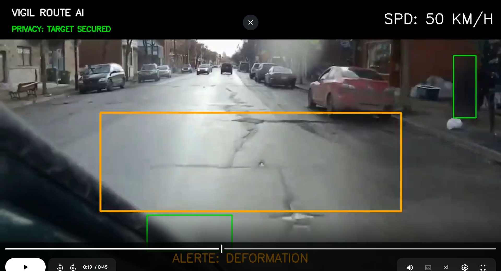
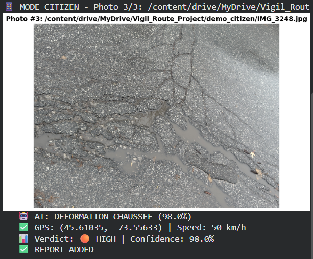
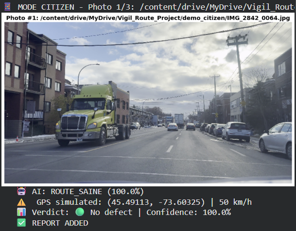

🚗 VIGIL-ROUTE: AI Road Defect Detection System

**Deep Learning system for automated road defect detection using MobileNetV2.**  
*A Privacy-First, Edge-AI solution for Smart Cities.*

Developed by **Persy Maki Ndombe** | AI/ML Engineering Student

---

**🌐 Language:** [🇬🇧 English](#) | [🇫🇷 Français](README_FR.md)

---

## 📌 Project Overview

VIGIL-ROUTE is a production-ready computer vision system that identifies road defects (potholes, pavement deformations) from images and videos with **87.9% accuracy**. 

Designed to bridge the gap between reactive repairs (citizen complaints) and proactive maintenance, it introduces a novel **Danger Scoring Algorithm** that prioritizes repairs based on vehicle speed and defect severity.

### 🎯 Key Features

- **🧠 MobileNetV2 Architecture**: Lightweight CNN optimized for mobile/edge deployment
- **📸 Dual-Mode Operation**: 
  - **Citizen Mode**: Process photos from 311 reporting apps with EXIF GPS extraction
  - **Fleet Mode**: Real-time dashcam video analysis with HUD overlay
- **📊 Automated Reporting**: Excel reports with color-coded urgency + Interactive HTML maps
- **🌍 GPS Integration**: 
  - **Citizen**: EXIF metadata extraction (smartphone photos)
  - **Fleet**: OBD-II hardware integration (vehicle telemetry)
- **🚨 Adaptive Risk Scoring**: Speed-based urgency prioritization algorithm
- **💧 Water Resistance**: Trained to detect water-filled potholes (rainy/winter conditions)
- **🗺️ Geospatial Visualization**: Interactive Folium maps with priority markers
- **🛡️ Privacy Architecture**: YOLOv8-based detection layer (pedestrian blur operational)

## 🎬 Demo & Visuals

### Fleet Mode (Real-Time Video Analysis)
*Dashcam processing with HUD overlay and privacy protection*

📹 **Full demo video (2 min):** [Watch on LinkedIn](#) *(coming soon)*  
🎥 **Alternative:** [Watch on YouTube](https://youtube.com/...) *(unlisted - available upon request)*

**Key Outputs:**
- Real-time defect detection with bounding boxes
- Danger scoring algorithm in action
- GPS trajectory mapping
- Frame-by-frame Excel analysis

---

### Citizen Mode (311 App Simulation)
*Processing smartphone photos with automatic geolocation*

**Example Detection Results:**

| Input Image | AI Classification | Confidence | Risk Level | Action Required |
|-------------|-------------------|------------|------------|-----------------|
|  | **POTHOLE** | 98.5% | 🔴 **CRITICAL** | Immediate Repair |
|  | **DEFORMATION** | 98% | 🟠 **HIGH** | Inspection Required |
|  | **HEALTHY ROAD** | 100% | 🟢 **NONE** | No Action |

**📊 Sample Reports:**
- [Excel Report (Demo)](demo_outputs/rapport_demo_anonymise.xlsx) - Color-coded urgency levels
- [Interactive Map (Demo)](demo_outputs/carte_interactive_demo.html) - Click to view geospatial visualization

---
## 🧠 The "Smart" Logic: Adaptive Risk Scoring

VIGIL-ROUTE doesn't just find holes; it assesses **danger**. A deformation at 30km/h is a nuisance; at 90km/h, it's a safety hazard.

### 1. Risk Calculation Formula

The system fuses Computer Vision confidence with vehicle telemetry data:
## 🧠 Decision Logic: The Danger Score

VIGIL-ROUTE doesn't just find holes—it **assesses real-world danger**. A deformation at 30 km/h is a nuisance; the same deformation at 90 km/h is a fatal risk.

The system calculates urgency with a simple equation:

**Defect Severity × Vehicle Speed = Intervention Priority**

### How it works

1. **AI identifies the defect**: A Pothole (severe) weighs more than a Deformation (moderate).
2. **System reads the speed**: The faster the vehicle, the more the danger score is amplified.
3. **The verdict is instant**:

| Context | Result | Required Action |
|---------|--------|-----------------|
| 🕳️ Pothole at 30 km/h | 🟡 MEDIUM | Monitoring |
| 🕳️ Same pothole at 50 km/h | 🟠 HIGH | Inspection |
| 🕳️ Same pothole at 90 km/h | 🔴 CRITICAL | Immediate Repair |

**Why this is revolutionary:** The same defect changes priority based on road context. Highways (high speed) are protected first, without wasting resources on 30 km/h residential streets.

### 2. Adaptive Detection Thresholds
To reduce false positives at high speeds (safety-first approach), the model dynamically adjusts its sensitivity:

Speed Zone	Pothole Threshold	Deformation Threshold	Rationale
High (≥70 km/h)	45% confidence	60% confidence	Highway speeds require conservative detection
Medium (50-69 km/h)	50% confidence	65% confidence	Urban arterial roads
Low (<50 km/h)	60% confidence	70% confidence	Residential zones allow stricter filtering
Why this matters: A false positive on a highway (70+ km/h) could cause dangerous braking. Lower thresholds = higher confidence required = fewer false alarms.

🚛 Deployment Modes & Hardware Requirements
Mode 1: CITIZEN (App Integration)
How it works:

Users submit photos via 311 mobile apps

System extracts GPS from EXIF metadata (iPhone/Android)

AI classifies defect type and urgency

Generates georeferenced report for city dispatch

Hardware: Smartphone only (iOS/Android)
GPS Accuracy: ±10-50 meters (consumer GPS)
Status: ✅ Fully Operational

Mode 2: FLEET (Municipal Vehicles)
How it works:

Dashcam captures video during regular routes

AI analyzes frames in real-time (or post-processing)

OBD-II reader provides speed data for risk scoring

Outputs annotated video + georeferenced Excel reports

⚠️ Hardware Integration Requirements:

While the software pipeline is fully functional, real-world fleet deployment requires physical hardware integration:

Component	Purpose	Status
OBD-II GPS Reader	Real-time vehicle location + speed	⚠️ Hardware integration pending
Dashcam	Video capture	✅ Any MP4 camera compatible
Edge Device	Run AI inference	✅ Raspberry Pi 4 / Jetson Nano tested
Data Sync	OBD-II ↔ Video timestamp alignment	⚠️ Requires fleet management integration
Recommended Devices:

FreeMatrix OBD-II Bluetooth (~$60 USD)

Verizon Hum OBD (~$10/month cellular)

Automatic Pro (~$130 WiFi + 4G)

Current Status:
✅ Software pipeline ready
⚠️ Hardware integration requires municipal fleet partnership

🛡️ Privacy & Ethics Module
Compliance with privacy laws (Quebec Law 25 / GDPR) is a core design principle.

Architecture Overview
The system includes a YOLOv8 detection layer to identify personal data before storage:

Feature	Technology	Status	Note
Pedestrian Protection	YOLOv8 (Class 0)	✅ Operational	Human detection and full-body Gaussian blur is functional
Vehicle Anonymization	YOLOv8 + Geometric Detection	⚠️ Prototype	License plate detection implemented as Proof-of-Concept. Production deployment requires specialized OCR/Privacy solutions
Transparency Note
As an AI Engineering student project, VIGIL-ROUTE provides the logical architecture for privacy protection. The pedestrian blur system is fully functional, but license plate anonymization would require collaboration with privacy technology specialists (e.g., Brighter AI, D-ID) for commercial deployment.

What works:

✅ YOLOv8 detects humans reliably

✅ Gaussian blur applied to detected regions

✅ Privacy-first data pipeline architecture

What requires professional integration:

⚠️ Certified license plate detection (OCR + blur)

⚠️ Legal compliance audit (city legal teams)

⚠️ GDPR/Law 25 documentation for municipal procurement

🏗️ Technical Specifications
Model Architecture (V9)
Component	Details
Framework	TensorFlow 2.19.0 / Keras
Base Model	MobileNetV2 (ImageNet pretrained, frozen)
Input Shape	224×224×3 RGB
Classes	nid_de_poule, deformation_chaussee, route_saine
Dataset	1,584 annotated images (Montreal, Oct-Dec 2025)
Test Accuracy	87.90%
Test Loss	0.3664
Inference Time	~12ms (GPU T4) / ~120ms (CPU Colab)
Why MobileNetV2 Over Object Detection?
Design Choice Rationale:

We chose Image Classification (MobileNetV2) over Object Detection (YOLOv8) for the core defect model to maximize efficiency on edge devices.

Approach	Model	Size	Inference	Use Case
Classification	MobileNetV2	14 MB	120ms (CPU)	"Is there a defect in this road segment?"
Detection	YOLOv8	44 MB	200ms (CPU)	"Where exactly is the defect pixel-by-pixel?"
Why Classification is Sufficient:

Municipalities repair road segments (100m sections), not individual pixels. MobileNetV2 provides the necessary "Zone Alert" at 1/3 the compute cost and 1/4 the model size.

Future Upgrade (V10): YOLOv8 segmentation planned for precise depth estimation (pothole volume calculation).

🗂️ Dataset Methodology
Collection Details
Period: October - December 2025
Location: Montreal, QC, Canada (various neighborhoods)
Conditions: Winter transition (rain, wet asphalt, light snow, road salt)
Device: iPhone (simulating citizen 311 app usage)

Why Winter Data Matters:

Montreal's harsh climate creates unique challenges:

💧 Water-filled potholes (November rains)

🍂 Autumn leaf coverage (October)

❄️ Early winter conditions (December salt/snow)

This seasonal diversity ensures the model works year-round, not just in ideal sunny conditions.

Class Distribution (1,584 Images)
text
deformation_chaussee: ~650 images (41%)
nid_de_poule:         ~580 images (37%)
route_saine:          ~354 images (22%)
Per-Class Performance (Test Set):

Class	Precision	Recall	F1-Score
deformation_chaussee	85%	91%	88%
nid_de_poule	83%	74%	79%
route_saine	100%	100%	100%
Key Insight: Perfect detection of healthy roads = No false alarms wasting city resources.

🚀 Quick Start
Installation
bash
git clone https://github.com/Persyvan/vigil-route.git
cd vigil-route
pip install -r requirements.txt
Usage (Inference)
python
from scripts.vigil_brain import VigilBrain

# Load Model
brain = VigilBrain('models/vigil_route_classifier_v9.keras')

# Analyze an image
result = brain.analyze('test_images/pothole_01.jpg', speed=60)
print(result)
# Output: {'class': 'nid_de_poule', 'confidence': 0.96, 'urgency': 'CRITICAL'}

---

## 📥 Model Access

The trained **MobileNetV2 model** (`vigil_route_classifier_v9_open_world.keras` - 89 MB) is available **upon request** for:

- 🎓 Academic research collaboration
- 🏙️ Smart city pilot projects  
- 🔬 Technical evaluation by municipal engineering teams
- 💼 Employment screening (recruiters/hiring managers)

### How to Request Access

📧 **Email:** persy.maki.ml@gmail.com

**Please include:**
1. Your name and affiliation (company/university)
2. Intended use case
3. Brief description of your project or evaluation purpose

**⏱️ Response time:** Access typically granted within 24-48 hours for legitimate requests.

### Future Public Release

Once the project reaches significant adoption, the model will be migrated to **🤗 Hugging Face Hub** for public access with proper licensing.

---

🔮 Roadmap & Future Work
Current Status (V9 - MVP)
✅ MobileNetV2 core trained (87.9% accuracy)

✅ Dual-mode pipeline operational

✅ Privacy architecture implemented (pedestrian blur)

✅ Risk scoring algorithm validated

✅ Excel + HTML map generation

Next Steps
V1.1 (Hardware Integration) - 3-6 months

 OBD-II GPS testing with municipal fleet

 Real-time speed data integration

 Cloud deployment (AWS Lambda / Google Cloud Run)

V2.0 (Advanced Detection) - 6-12 months

 YOLOv8 segmentation for volumetric analysis (pothole depth)

 Certified privacy module integration

 Multi-city dataset expansion (Toronto, Quebec City)

V3.0 (Commercial Pilot) - 12+ months

 311 API integration (City of Montreal)

 Full municipal pilot program (10-vehicle fleet)

 Real-world validation study

🤝 Contact & Collaboration
This project is an Applied AI Research Prototype developed as part of my AI/ML engineering studies. I am open to collaboration with:

🏙️ Smart City initiatives

🚗 Municipal fleet management departments

🔬 Research institutions (Computer Vision / Infrastructure)

💼 Engineering consulting firms

Persy Maki ND
AI/ML Engineering Student
Specialized in Computer Vision & Smart Cities

📧 Email: persy.maki.ml@gmail.com

💼 LinkedIn: Persy Maki Ndombe

🐙 GitHub: @Persyvan

📍 Location: Montreal, QC, Canada

📄 License
MIT License - See LICENSE for details.

Copyright © 2026 Persy Maki Ndombe

🙏 Acknowledgments
Dataset: Self-collected Montreal road images (Oct-Dec 2025)

Framework: TensorFlow, Keras, OpenCV, Ultralytics (YOLOv8)

Platform: Google Colab Pro

Inspiration: Municipal 311 systems, Smart City infrastructure monitoring

⭐ If this project interests you, please star the repository!

🌐 Read in other languages: 🇫🇷 Français

Last updated: January 2026 | Model Version: V9
