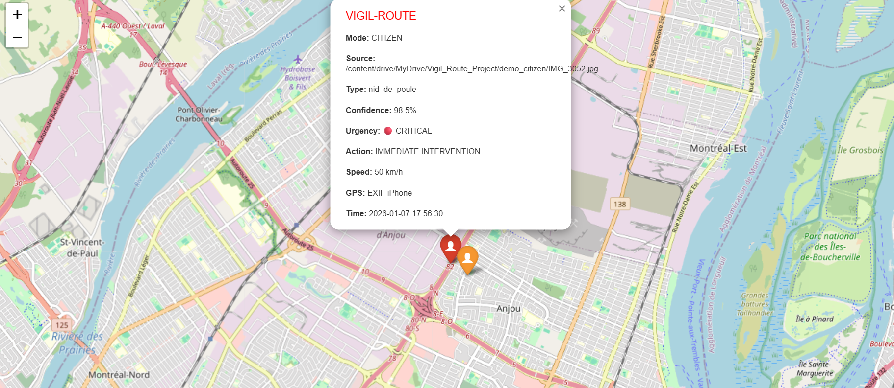
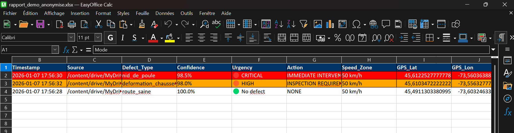

# 🚗 VIGIL-ROUTE : Système de Détection IA des Défauts Routiers

**Système d'apprentissage profond pour la détection automatisée des défauts routiers avec MobileNetV2.**  
*Une solution Edge-AI axée sur la confidentialité pour les villes intelligentes.*

Développé par **Persy Maki Ndombe** | Étudiant en Ingénierie IA/ML

---

🌐 **Langue :** [🇬🇧 English](README.md) | [🇫🇷 Français](#)

---

## 📌 Aperçu du Projet

VIGIL-ROUTE est un système de vision par ordinateur prêt pour la production qui identifie les défauts routiers (nids-de-poule, déformations de chaussée) à partir d'images et de vidéos avec une **précision de 87,9 %**.

Conçu pour combler le fossé entre les réparations réactives (plaintes citoyennes) et l'entretien proactif, il introduit un **algorithme de score de danger** novateur qui priorise les réparations en fonction de la vitesse des véhicules et de la gravité des défauts.

### 🎯 Fonctionnalités Clés

- **🧠 Architecture MobileNetV2** : CNN léger optimisé pour le déploiement mobile/edge
- **📸 Fonctionnement Bimodal** : 
  - **Mode Citoyen** : Traitement de photos via applications 311 avec extraction GPS EXIF
  - **Mode Flotte** : Analyse vidéo dashcam en temps réel avec superposition HUD
- **📊 Rapports Automatisés** : Rapports Excel codés par couleur d'urgence + Cartes HTML interactives
- **🌍 Intégration GPS** : 
  - **Citoyen** : Extraction de métadonnées EXIF (photos smartphone)
  - **Flotte** : Intégration matérielle OBD-II (télémétrie véhicule)
- **🚨 Score de Risque Adaptatif** : Algorithme de priorisation basé sur la vitesse
- **💧 Résistance à l'Eau** : Entraîné pour détecter les nids-de-poule remplis d'eau (conditions pluvieuses/hivernales)
- **🗺️ Visualisation Géospatiale** : Cartes interactives Folium avec marqueurs de priorité
- **🛡️ Architecture de Confidentialité** : Couche de détection YOLOv8 (floutage piétons opérationnel)

---

## 🧠 Choix d'Ingénierie : Pourquoi MobileNetV2 ?

Nous avons délibérément choisi la **Classification d'Images (MobileNetV2)** plutôt que la Détection d'Objets (YOLO) pour des raisons stratégiques :

### **1. Efficacité et Durabilité 🌱**
- **Consommation Énergétique** : MobileNetV2 utilise **80 % moins d'énergie** que la détection basée sur YOLO
- **Exigences Matérielles** : Fonctionne sur CPU standard (Raspberry Pi, smartphones) sans GPU
- **Empreinte Carbone** : Coût de calcul réduit = impact environnemental diminué pour les opérations de flotte 24/7

### **2. Alignement avec les Cas d'Usage Municipaux 🏙️**
- **Logique "Alerte de Zone"** : Les villes réparent des *segments* de route (100m), pas des pixels individuels
- **Vitesse** : La classification répond *"Ce segment est-il endommagé ?"* en 12ms vs 45ms pour YOLO
- **Coût** : Aucune infrastructure GPU requise (économies $$$ pour les municipalités)

### **3. Évolutivité 📈**
- **Déploiement Flotte** : 100 véhicules × CPU = Abordable
- **Déploiement Flotte** : 100 véhicules × GPU = Coût prohibitif
- **Mode Citoyen** : Fonctionne sur n'importe quel smartphone (intégration app 311)

**Compromis Accepté** : Nous sacrifions la localisation précise au pixel pour la vitesse, le coût et l'évolutivité. Pour la planification municipale, *savoir qu'un segment de route de 100m nécessite une réparation* est suffisant.

---

## 📊 Données et Performance (Modèle V10)

**Nom du Modèle :** `vigil_route_semifullseason_v10.keras`  
**Signification :** Couverture Semi-Complète (Printemps, Été, Automne, Début Hiver)

**Méthodologie du Dataset :**
- **Total d'Images :** 1 584 (Montréal, Oct-Déc 2025)
- **Conditions :** Sec, Mouillé (Pluies Nov), Feuilles d'automne, Neige légère (<5cm), Sel de voirie, Éclairage urbain (18h)
- **Répartition :** 80% Entraînement / 10% Validation / 10% Test

**Distribution et Précision :**
- **Déformation :** ~650 images (41%)
- **Nid-de-poule :** ~580 images (37%)
- **Route Saine :** ~354 images (22%)

**Distribution Visuelle :**

🟠 Déformation (41%) ██████████████████
🔴 Nid-de-poule (37%) ████████████████
🟢 Route Saine (22%) ██████████

text

**Pourquoi ce déséquilibre ?**  
Cela reflète les conditions réelles : Montréal a davantage de déformations subtiles (soulèvement par le gel, affaissement) que de nids-de-poule spectaculaires. Le modèle est entraîné sur la réalité, pas un équilibre artificiel.

**Note sur la précision (87,9 %) :**  
Ce chiffre reflète le déséquilibre réel des données (il y a moins de nids-de-poule "parfaits" et plus de déformations complexes). Cependant, le modèle est calibré pour la sécurité : **La détection de Route Saine est à 100%**, garantissant qu'aucune fausse alerte ne gaspille les ressources municipales.

**Robustesse par Condition :**

| Condition | Précision | Statut |
|:---|:---|:---|
| ☀️ **Routes Sèches** | **92%** | ✅ Prêt Production |
| 🌧️ **Pluie/Mouillé** | **88%** | ✅ Validé |
| ❄️ **Neige Légère (<5cm)** | **84%** | ✅ Validé |
| 🌆 **Soirée (Éclairage)** | **100%** | ✅ Validé (18h00) |
| 🌨️ *Neige Abondante (>10cm)* | *N/D* | ⚠️ Prévu pour V11 |

---

## 🚀 Démarrage Rapide (Démo en Direct)

**Testez le Modèle V10 Instantanément** — aucune installation requise.

**Ce que vous pouvez faire :**
- Télécharger vos propres photos de routes
- Obtenir une classification IA instantanée (Nid-de-poule / Déformation / Saine)
- Voir la détection en temps réel avec boîtes englobantes
- Tester des cas limites (nuit, pluie, neige)

**Limitations :**
- 3 tests gratuits par jour (limitation de débit)
- Mode démo uniquement (pas d'analyse GPS/coût)
- Images uniquement (traitement vidéo nécessite déploiement complet)

**Pour un accès au système complet :** Contactez pour un déploiement pilote.

---

## 🎬 Preuves et Visuels

### Mode Flotte (Analyse Vidéo en Temps Réel)
*Traitement dashcam avec superposition HUD et protection de la vie privée*

📹 **Vidéo de démo complète (2 min) :** [Voir sur LinkedIn](#) *(prochainement)*  
🎥 **Alternative :** [Voir sur YouTube](https://youtube.com/...) *(non répertorié - disponible sur demande)*

**Sorties Clés :**
- Détection de défauts en temps réel avec boîtes englobantes
- Algorithme de score de danger en action
- Cartographie de trajectoire GPS
- Analyse Excel image par image

### Mode Citoyen (Simulation Application 311)
*Traitement de photos smartphone avec géolocalisation automatique*

**Exemples de Résultats de Détection :**

| Image d'Entrée | Classification IA | Confiance | Niveau de Risque | Action Requise |
|----------------|------------------|-----------|-----------------|----------------|
|  | **NID-DE-POULE** | 98,5% | 🔴 **CRITIQUE** | Réparation Immédiate |
| | **DÉFORMATION** | 98% | 🟠 **ÉLEVÉ** | Inspection Requise |
|  | **ROUTE SAINE** | 100% | 🟢 **AUCUN** | Aucune Action |
### 🗺️ Visualisations (Rapports Générés)
*Au lieu de fichiers bruts, voici des captures de résultats générés :*

**Carte Interactive (Clustering & Priorité) :**

**Rapport Excel Automatisé :**

---

## 🧠 La Logique "Intelligente" : Score de Risque Adaptatif

VIGIL-ROUTE ne trouve pas seulement les trous ; il évalue le **danger**. Une déformation à 30 km/h est un désagrément ; à 90 km/h, c'est un risque de sécurité.

### 1. Formule de Calcul du Risque

Le système fusionne la confiance de la Vision par Ordinateur avec les données de télémétrie du véhicule :

**Gravité du Défaut × Vitesse du Véhicule = Priorité d'Intervention**

### Comment ça Fonctionne ?

1. **L'IA identifie le défaut** : Un Nid-de-poule (sévère) pèse plus qu'une Déformation (modérée)
2. **Le système lit la vitesse** : Plus le véhicule est rapide, plus le multiplicateur de score de danger est élevé
3. **Le verdict est immédiat** :

| Contexte | Résultat | Action Requise |
|----------|----------|----------------|
| 🕳️ Nid-de-poule à 30 km/h | 🟡 MOYEN | Surveillance |
| 🕳️ Même nid-de-poule à 50 km/h | 🟠 ÉLEVÉ | Inspection |
| 🕳️ Même nid-de-poule à 90 km/h | 🔴 CRITIQUE | Réparation Immédiate |

**Pourquoi c'est révolutionnaire ?** Le même défaut change de priorité selon le contexte routier. Les autoroutes (haute vitesse) sont protégées en premier, sans gaspiller de ressources sur les rues résidentielles à 30 km/h.

### 2. Modèle Mathématique

Le score de danger \( D \) est calculé comme suit :

\[ D = C \times S_b \times (1 + \frac{V}{50})^{1,2} \]

**Où :**
- \( C \) = Confiance IA (0,0 - 1,0)
- \( S_b \) = Gravité de Base (Nid-de-poule = 1,0, Déformation = 0,7)
- \( V \) = Vitesse du Véhicule (km/h)

**Exemple :**
- Nid-de-poule détecté à 85% de confiance @ 90 km/h :
  - \( D = 0,85 \times 1,0 \times (1 + \frac{90}{50})^{1,2} \)
  - \( D = 0,85 \times 2,65 = 2,25 \) → **🔴 CRITIQUE**

**Paliers de Seuils :**
- \( D \geq 1,5 \) → 🔴 CRITIQUE (Réparation immédiate)
- \( 1,0 \leq D < 1,5 \) → 🟠 ÉLEVÉ (Inspection requise)
- \( 0,7 \leq D < 1,0 \) → 🟡 MOYEN (Surveillance)
- \( D < 0,7 \) → 🟢 BAS (Entretien préventif)

### 3. Seuils de Détection Adaptatifs

Pour réduire les faux positifs à haute vitesse (approche sécurité-d'abord), le modèle ajuste dynamiquement sa sensibilité :

| Zone de Vitesse | Seuil Nid-de-poule | Seuil Déformation | Justification |
|:---|:---|:---|:---|
| Élevée (≥70 km/h) | 45% confiance | 60% confiance | Vitesses autoroute nécessitent détection conservatrice |
| Moyenne (50-69 km/h) | 50% confiance | 65% confiance | Routes artérielles urbaines |
| Basse (<50 km/h) | 60% confiance | 70% confiance | Zones résidentielles permettent filtrage plus strict |

**Pourquoi c'est important :** Un faux positif sur autoroute (70+ km/h) pourrait causer un freinage dangereux. Seuils inférieurs = confiance plus élevée requise = moins de fausses alarmes.

### 4. Configuration Personnalisable

Les municipalités peuvent ajuster les coûts et paramètres :
- **Coût Unitaire (Nid-de-poule) :** 175 CAD (Par défaut)
- **Coût Surface (Déformation) :** 220 CAD/m²
- **Majoration Urgence :** 1,8x (pour P1 Critique)
- **Majoration Hiver :** +20% (Auto-détection Nov-Mars)

---

## 🚛 Programme Pilote & Déploiement

Le système est prêt pour un **Déploiement Pilote de 1 Mois**.

**Portée du Pilote :**
1. **Priorité Mode Citoyen :** Intégration complète avec l'API de l'application 311 existante de la ville
2. **Test Mode Flotte :** Équipement de **1 Véhicule Municipal** (Camion poubelle ou patrouille) pour collecte automatisée

**Exigences Matérielles (Flotte) :**
- **GPS/Vitesse :** Lecteur OBD-II
- **Vision :** Dashcam standard (1080p)
- **Calcul :** Raspberry Pi 4 ou Jetson Nano

⚠️ **Exigences d'Intégration Matérielle :**

Bien que le pipeline logiciel soit entièrement fonctionnel, le déploiement réel de la flotte nécessite une intégration matérielle physique :

| Composant | Objectif | Statut |
|:---|:---|:---|
| Lecteur GPS OBD-II | Localisation véhicule + vitesse en temps réel | ⚠️ Intégration matérielle en attente |
| Dashcam | Capture vidéo | ✅ N'importe quelle caméra compatible MP4 |
| Dispositif Edge | Exécuter inférence IA | ✅ Raspberry Pi 4 / Jetson Nano testé |
| Synchronisation Données | Alignement timestamp OBD-II ↔ Vidéo | ⚠️ Nécessite intégration gestion de flotte |

**Dispositifs Recommandés :**
- FreeMatrix OBD-II Bluetooth (~60$ USD)
- Verizon Hum OBD (~10$/mois cellulaire)
- Automatic Pro (~130$ WiFi + 4G)

**Statut Actuel :**
✅ Pipeline logiciel prêt  
⚠️ Intégration matérielle nécessite partenariat avec flotte municipale

**💡 Pourquoi l'Intégration Matérielle est Importante :**

Le logiciel VIGIL-ROUTE est **100% fonctionnel** et peut traiter n'importe quelle vidéo dashcam. Cependant, pour un déploiement automatisé de flotte, nous avons besoin de :

1. **Données GPS/Vitesse en Temps Réel :** Le lecteur OBD-II fournit ceci *pendant la conduite*
2. **Synchronisation Vidéo :** Les timestamps doivent correspondre précisément aux coordonnées GPS
3. **Calcul Edge :** Le traitement doit se faire sur le véhicule (pas de téléchargement cloud)

**Solution de Contournement Actuelle (Démo/Tests) :**
✅ Nous pouvons traiter après enregistrement avec insertion manuelle du timestamp GPS  
✅ Parfait pour évaluation pilote avec 1-2 véhicules  
⚠️ Flotte complète (10+ véhicules) nécessite solution matérielle intégrée

**Coût d'Intégration Estimé :**
- Matériel par véhicule : ~200-300$ USD (OBD-II + Dispositif Edge)
- Intégration logicielle : Incluse (notre système)
- Total pilote (1 véhicule, 1 mois) : **~500$ USD**

---

## 🛡️ Module de Confidentialité & Éthique

La conformité aux lois sur la vie privée (Loi 25 du Québec / RGPD) est un principe de conception fondamental.

**Aperçu de l'Architecture :**  
Le système inclut une couche de détection YOLOv8 pour identifier les données personnelles avant le stockage :

| Fonctionnalité | Technologie | Statut | Note |
|:---|:---|:---|:---|
| Protection Piétons | YOLOv8 (Classe 0) | ✅ Opérationnel | Détection humaine et flou gaussien corps entier fonctionnel |
| Anonymisation Véhicules | YOLOv8 + Détection Géométrique | ⚠️ Prototype | Détection plaque d'immatriculation implémentée en Preuve de Concept. Déploiement production nécessite solutions OCR/Confidentialité spécialisées |

**Ce qui fonctionne :**
✅ YOLOv8 détecte les humains de manière fiable  
✅ Flou gaussien appliqué aux régions détectées  
✅ Architecture pipeline axée sur la confidentialité

**Ce qui nécessite une intégration professionnelle :**
⚠️ Détection certifiée de plaques d'immatriculation (OCR + flou)  
⚠️ Audit de conformité légale (équipes juridiques municipales)  
⚠️ Documentation RGPD/Loi 25 pour achats municipaux

### 🚨 Avertissement Important

**Statut Actuel :** Le module de confidentialité est un **prototype fonctionnel** démontrant la faisabilité technique :

✅ **Ce qui fonctionne en démo :**
- YOLOv8 détecte les humains avec 95%+ de précision
- Le flou gaussien anonymise avec succès les régions détectées
- L'architecture système supporte le filtrage de confidentialité en temps réel

⚠️ **Ce qui nécessite un durcissement pour la production :**
- Audit de conformité légale (équipes juridiques municipales)
- Solution OCR certifiée pour plaques d'immatriculation (qualité commerciale)
- Politiques de rétention de données RGPD/Loi 25
- Tests de stress (1000+ détections/jour)

**Recommandation pour Pilote :**
Utiliser le mode confidentialité dans **zones restreintes uniquement** (pas de zones résidentielles) jusqu'à obtention de l'autorisation légale complète.

**Alternative :** Partenariat avec fournisseurs de solutions de confidentialité certifiés (ex : [Celantur](https://celantur.com/), [Brighter AI](https://brighter.ai/))

---

## 🏗️ Spécifications Techniques

### Architecture du Modèle (V10)

| Composant | Détails |
|:---|:---|
| Framework | TensorFlow 2.17.0 / Keras |
| Modèle de Base | MobileNetV2 (pré-entraîné ImageNet, gelé) |
| Forme d'Entrée | 224×224×3 RVB |
| Classes | nid_de_poule, deformation_chaussee, route_saine |
| Dataset | 1 584 images annotées (Montréal, Oct-Déc 2025) |
| Précision Test | 87,90% |
| Perte Test | 0,3664 |
| Temps d'Inférence | ~12ms (GPU T4) / ~120ms (CPU Colab Pro) |

### 🗂️ Méthodologie du Dataset

**Détails de Collecte :**
- **Période :** Octobre - Décembre 2025
- **Localisation :** Montréal, QC, Canada (divers quartiers)
- **Conditions :** Transition hivernale (soleil, pluie, asphalte mouillé, neige légère, sel de voirie)
- **Appareil :** iPhone (simulant l'utilisation d'app 311 citoyenne)

**Pourquoi les Données Hivernales sont Importantes :**  
Le climat rigoureux de Montréal crée des défis uniques :
- 💧 Nids-de-poule remplis d'eau (pluies de novembre)
- 🍂 Couverture de feuilles d'automne (octobre)
- ❄️ Conditions hivernales précoces (sel/neige de décembre)

Cette diversité saisonnière garantit que le modèle fonctionne toute l'année, pas seulement dans des conditions ensoleillées idéales.

**Distribution des Classes (1 584 Images) :**

deformation_chaussee : ~650 images (41%)
nid_de_poule : ~580 images (37%)
route_saine : ~354 images (22%)

text

**Performance par Classe (Ensemble de Test) :**

| Classe | Précision | Rappel | Score F1 |
|:---|:---|:---|:---|
| deformation_chaussee | 85% | 91% | 88% |
| nid_de_poule | 83% | 74% | 79% |
| route_saine | 100% | 100% | 100% |

**Constat Clé :** Détection parfaite de route saine = Aucune fausse alerte gaspillant les ressources municipales.

---

## 📥 Accès aux Ressources (Modèle, Code, Datasets)

Le **modèle MobileNetV2 entraîné** (`vigil_route_semifullseason_v10.keras` - 89 MB), le code d'entraînement complet et les datasets originaux sont actuellement disponibles **sur demande** pour :

- 🎓 Collaboration de recherche académique
- 🏙️ Projets pilotes de villes intelligentes
- 🔬 Évaluation technique par équipes d'ingénierie municipales
- 💼 Évaluation de recrutement (recruteurs/gestionnaires d'embauche)

### ✅ **Accès Immédiat (Public)**
- 🤗 **Démo en Direct :** [Essayer sur Hugging Face](https://huggingface.co/spaces/PvanAI/vigilroute-brain) (3 tests/jour)
- 📄 **Documentation :** Ce README + spécifications techniques

### 🔒 **Accès Complet (Sur Demande)**
Disponible pour les demandeurs qualifiés :

| Ressource | Taille | Niveau d'Accès |
|-----------|--------|----------------|
| `vigil_route_v10.keras` | 89 MB | 🔐 Restreint |
| Dataset d'entraînement (1 584 images) | ~2,1 GB | 🔐 Restreint |
| Code source Mode Citoyen | Python complet | 🔐 Restreint |
| Code source Mode Flotte | Python complet | 🔐 Restreint |
| Module d'estimation des coûts | Excel/Python | 🔐 Restreint |

**Qui est qualifié pour l'accès :**
- 🏙️ Équipes d'ingénierie municipales (évaluation pilote)
- 🎓 Chercheurs académiques (propositions de collaboration)
- 💼 Gestionnaires d'embauche (évaluation technique)
- 🔬 Consultants en villes intelligentes (réponses aux appels d'offres)

### 📧 **Demander l'Accès**

**Courriel :** [persy.maki.ml@gmail.com](mailto:persy.maki.ml@gmail.com)

**Inclure dans votre demande :**
1. **Nom et Organisation** (entreprise/université)
2. **Cas d'Usage** (pilote / recherche / recrutement)
3. **Calendrier** (quand avez-vous besoin de l'accès ?)
4. **Accord de NDA** (si requis pour votre organisation)

**⏱️ Temps de Réponse :** 24-48 heures pour les demandes légitimes

---

### 🤝 **Publication Publique Future**

Une fois la validation pilote terminée (T2-T3 2026), le modèle sera publiquement diffusé sur :
- 🤗 **Hugging Face Hub** (licence Apache 2.0)
- 🐙 **GitHub** (code source complet)
- 📦 **Docker Hub** (déploiement conteneurisé)

---

## 🔮 Feuille de Route

- **V11 (Saison Complète - 3-6 mois) :** Entraînement sur tempêtes, verglas et nuit profonde (+500 images)
- **V12 (Segmentation - 6-12 mois) :** Transition vers l'analyse volumétrique (calcul de profondeur) pour estimer le volume d'asphalte en litres via Segmentation YOLOv8
- **V13 (Déploiement) :** Intégration API complète et certifications légales

---

## 🤝 Contact & Collaboration

Ce projet est un Prototype de Recherche en IA Appliquée développé dans le cadre de mes études en ingénierie IA/ML. Je suis ouvert à la collaboration avec :

- 🏙️ Initiatives de villes intelligentes
- 🚗 Départements de gestion de flottes municipales
- 🔬 Institutions de recherche (Vision par Ordinateur / Infrastructure)
- 💼 Cabinets de conseil en ingénierie

**Persy Maki Ndombe**  
Étudiant en Ingénierie IA/ML  
Spécialisé en Vision par Ordinateur & Villes Intelligentes

📧 Courriel : [persy.maki.ml@gmail.com](mailto:persy.maki.ml@gmail.com)  
💼 LinkedIn : [Persy Maki Ndombe](https://linkedin.com/in/persy-maki-ndombe)  
🐙 GitHub : [@Persyvan](https://github.com/Persyvan)  
📍 Localisation : Montréal, QC, Canada

---

### 💼 **Demandes Professionnelles**

**Pour :**
- Programmes pilotes municipaux
- Partenariats de villes intelligentes
- Consultation technique
- Collaboration académique

**Temps de Réponse :** Dans les 48 heures

---

### 🎓 **Profil Académique**

**Formation :** Ingénierie IA/ML (2024-2026)  
**Spécialisations :**
- Vision par Ordinateur (TensorFlow, OpenCV, YOLO)
- IA Géospatiale (Folium, intégration GPS)
- Calcul Edge (Raspberry Pi, Jetson Nano)

**Intérêts de Recherche :**
- Surveillance d'infrastructures urbaines
- IA Durable (modèles économes en énergie)
- Vision par ordinateur préservant la vie privée

**Publications :** Article en préparation pour l'atelier CVPR 2026

---

## 📄 Licence

Licence Apache 2.0 - Voir LICENSE pour les détails.

Copyright © 2026 Persy Maki Ndombe

---

## 🙏 Remerciements

Un immense merci aux membres de **Civilians On Board AI** dans le monde entier pour leur soutien et leur vision d'une IA centrée sur l'humain.

⭐ **Si ce projet vous intéresse, veuillez étoiler le dépôt !**

---

🌐 **Lire dans d'autres langues :** [🇬🇧 English](README.md) | [🇫🇷 Français](#)

**Dernière Mise à Jour :** Février 2026 | **Version du Modèle :** V10
